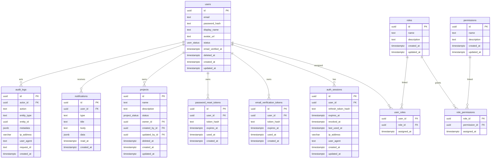

# ERD

```mermaid
erDiagram
  users ||--o{ auth_sessions : has
  users ||--o{ user_roles : assigned
  roles ||--o{ user_roles : linked
  roles ||--o{ role_permissions : grants
  permissions ||--o{ role_permissions : linked
  users ||--o{ email_verification_tokens : owns
  users ||--o{ password_reset_tokens : owns
  users ||--o{ projects : owns
  users ||--o{ notifications : receives
  users ||--o{ audit_logs : acts

  users {
    uuid id PK
    text email
    text password_hash
    text display_name
    text avatar_url
    user_status status
    timestamptz email_verified_at
    timestamptz deleted_at
    timestamptz created_at
    timestamptz updated_at
  }

  auth_sessions {
    uuid id PK
    uuid user_id FK
    text refresh_token_hash
    timestamptz expires_at
    timestamptz revoked_at
    timestamptz last_used_at
    varchar ip_address
    text user_agent
    timestamptz created_at
    timestamptz updated_at
  }

  roles {
    uuid id PK
    text name
    text description
    timestamptz created_at
    timestamptz updated_at
  }

  permissions {
    uuid id PK
    text name
    text description
    timestamptz created_at
    timestamptz updated_at
  }

  user_roles {
    uuid user_id FK
    uuid role_id FK
    timestamptz assigned_at
  }

  role_permissions {
    uuid role_id FK
    uuid permission_id FK
    timestamptz assigned_at
  }

  email_verification_tokens {
    uuid id PK
    uuid user_id FK
    text token_hash
    timestamptz expires_at
    timestamptz used_at
    timestamptz created_at
  }

  password_reset_tokens {
    uuid id PK
    uuid user_id FK
    text token_hash
    timestamptz expires_at
    timestamptz used_at
    timestamptz created_at
  }

  projects {
    uuid id PK
    text name
    text description
    project_status status
    uuid owner_id FK
    uuid created_by_id FK
    uuid updated_by_id FK
    timestamptz deleted_at
    timestamptz created_at
    timestamptz updated_at
  }

  notifications {
    uuid id PK
    uuid user_id FK
    text type
    text title
    text body
    jsonb data
    timestamptz read_at
    timestamptz created_at
  }

  audit_logs {
    uuid id PK
    uuid actor_id FK
    text action
    text entity_type
    uuid entity_id
    jsonb metadata
    varchar ip_address
    text user_agent
    text request_id
    timestamptz created_at
  }
```
